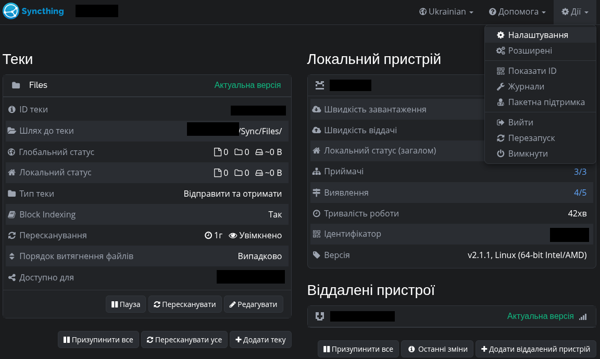
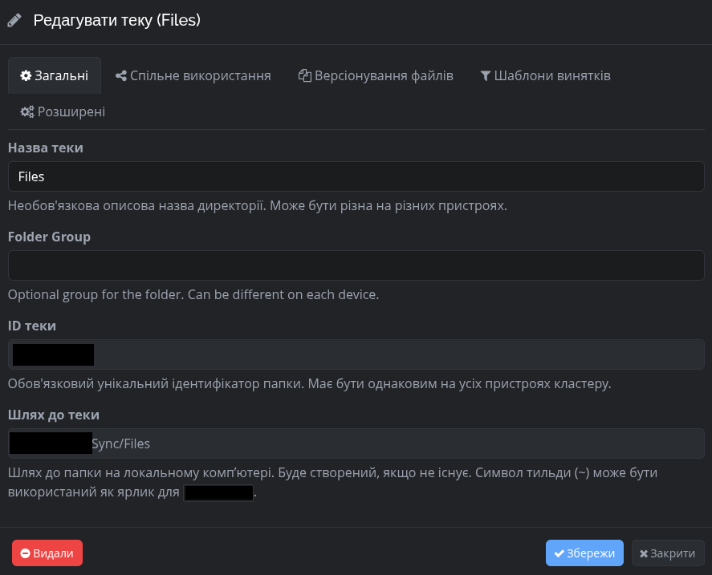

# Graphite Dark Theme for Syncthing

Оригінальна графітова темна тема для веб-інтерфейсу Syncthing. Створена для комфортної роботи в нічний час, зниження навантаження на очі та надання інтерфейсу сучасного, мінімалістичного вигляду у стриманих темно-сірих тонах з акуратними синіми акцентами.

## 📸 Скріншот інтерфейсу




## 🛠 Встановлення

Встановлення виконується вручну шляхом створення кастомного каталогу веб-інтерфейсу (`gui`) у папці конфігурації вашої інсталяції Syncthing.

### Крок 1. Перехід до папки конфігурації Syncthing

Залежно від способу встановлення Syncthing та дистрибутива Linux, папка конфігурації може знаходитися за одним із наведених нижче шляхів. Знайдіть той, який використовується у вашій системі:

- **Сучасний стандартний шлях користувача (наприклад, у Fedora):**
  
  ```bash
  ~/.local/state/syncthing/
  ```

- **Класичний шлях конфігурації користувача:**
  
  ```bash
  ~/.config/syncthing/syncthing/
  ```

- **Для загальносистемного встановлення (System Installs):**
  
  ```bash
  /usr/share/syncthing/
  ```

### Крок 2. Створення папки `gui` та копіювання теми

- Перейдіть у знайдену директорію Syncthing.

- Якщо всередині ще немає папки з назвою `gui`, **обов'язково створіть її**.

- Усередині папки `gui` створіть підпапку для теми з назвою `graphite-dark`.

Структура файлів повинна мати такий вигляд (на прикладі шляху конфігурації):

```text
~/.config/syncthing/ (~/.local/state/syncthing/ або /usr/share/syncthing/)
└── gui/
    └── graphite-dark/
       └── assets/
           └── css/
               └── theme.css
```

### Крок 3. Активація теми у веб-інтерфейсі

- Перезапустіть сервіс Syncthing, щоб він побачив нову папку.

> Для користувацького сервісу

```bash
systemctl --user restart syncthing
```

> Для системного сервісу:

```bash
sudo systemctl restart syncthing
```

- Відкрийте веб-інтерфейс Syncthing у браузері.

- Перейдіть у **Дії** (Actions) -> **Налаштування** (Settings) -> вкладка **Веб-інтерфейс** (GUI).

- У випадаючому списку **Тема** (Theme) виберіть зі списку **graphite-dark**.

- Натисніть **Зберегти** (Save) та за потреби оновіть сторінку через `Ctrl + F5`.

# 
